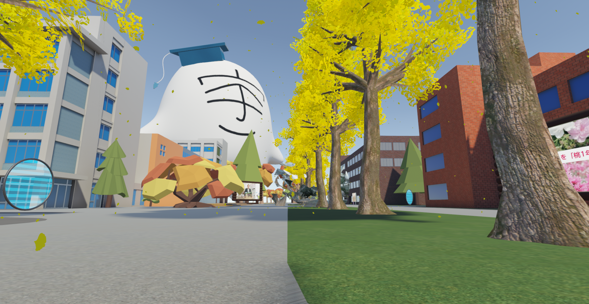

# バーチャル宇都宮大学 告知サイト

バーチャル宇都宮大学 2021 年度版リポジトリ

<p align="center">

</p>

## 2020年のバーチャル宇都宮大学はこちらから

- [UUVR 2020 サイト](https://2020.vr-uu.com/)
- [UUVR 2020 Repository](https://github.com/u-lab/uuvr.github.io)

## スプレッドシートの更新

```shell
# package install
$ npm --prefix ./scripts/FetchNewsList install

# スプレッドシートの更新
$ npm --prefix ./scripts/FetchNewsList run generate | sed '1,4d' > docs/js/news.js
```
